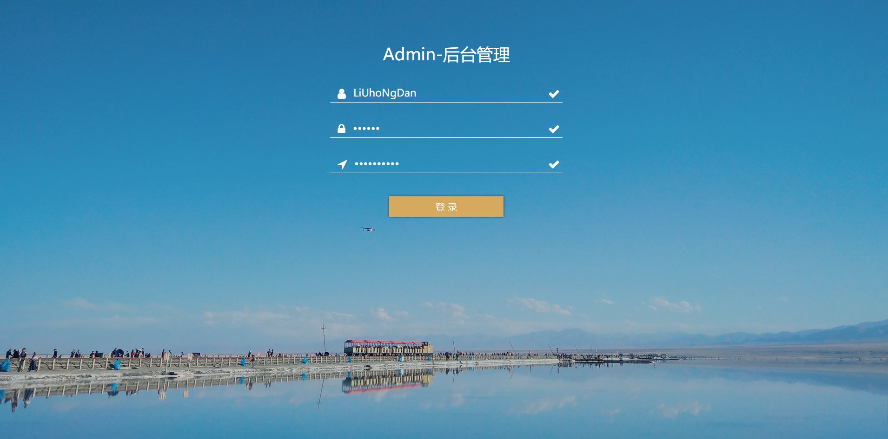
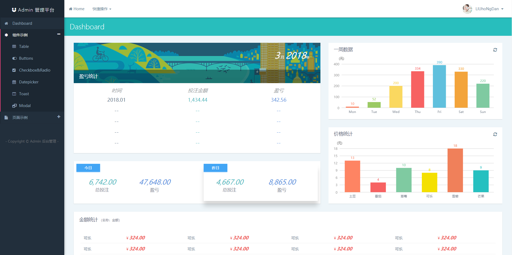
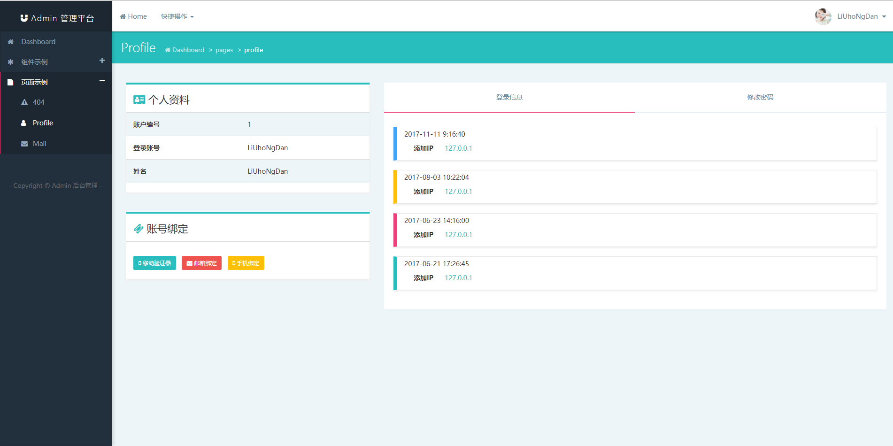
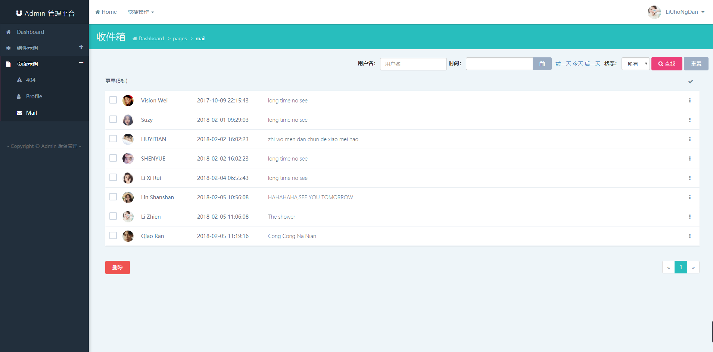
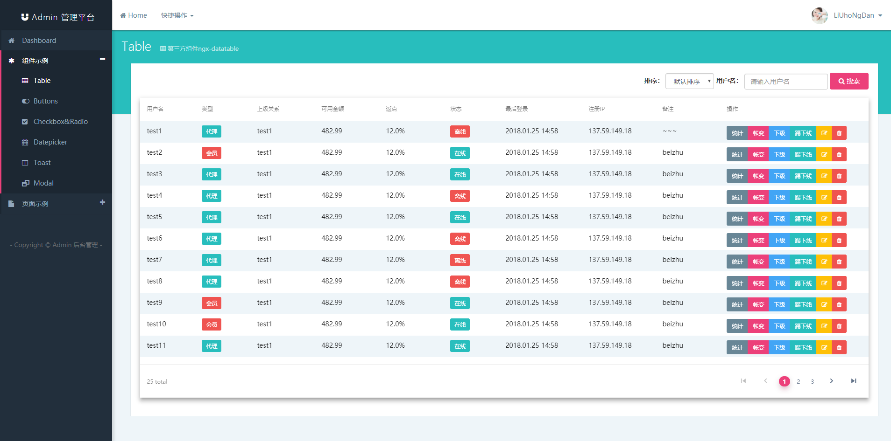
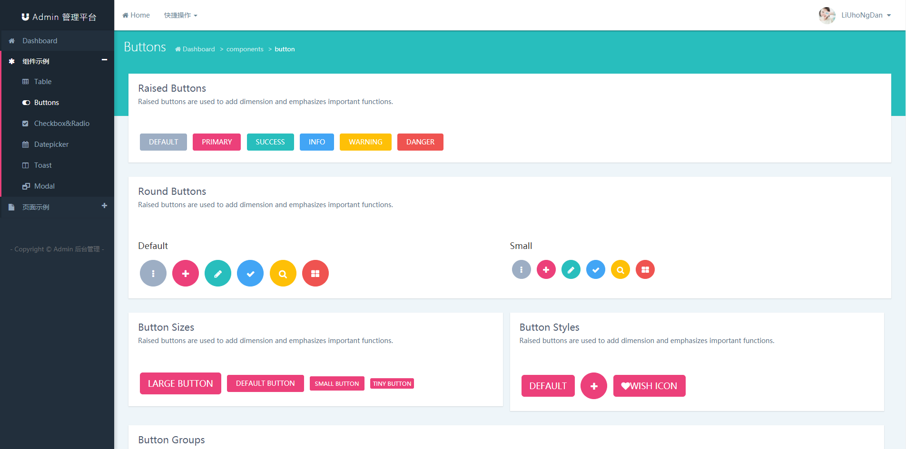
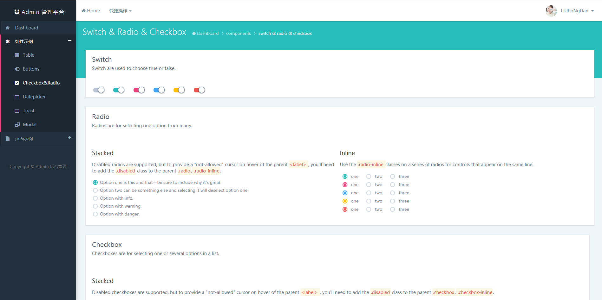
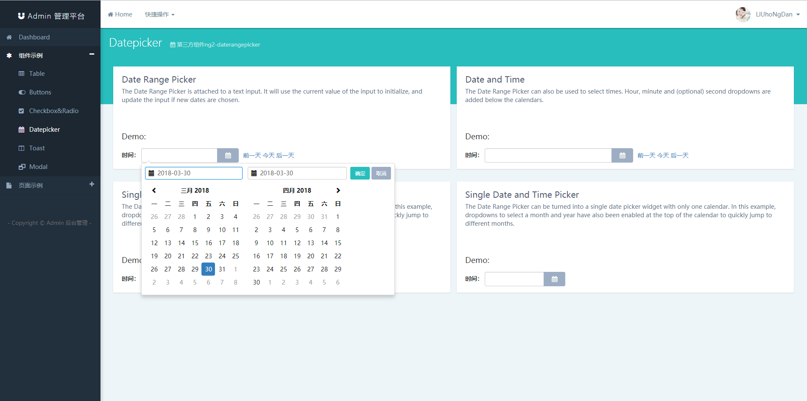
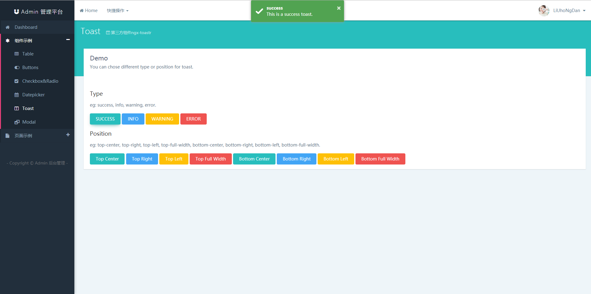

# 后台管理系统
一个基于angular5.0.0+ng-bootstrap1.0.0-beta.5+bootstrap3.3.7+scss的后台管理系统界面

# 页面展示
## 1、login

## 2、dashboard
首页用到了图表，用的是echarts，附上[echarts的官网](http://echarts.baidu.com/)，有兴趣的可以去学习一下。

## 3、profile

## 4、mail

# 组件展示
## 1、table
用到了第三方的组件[ngx-datatable](https://github.com/swimlane/ngx-datatable)，大家可以去github上看一下，官方也有很多[示例](http://swimlane.github.io/ngx-datatable/)。

## 2、button

## 3、checkbox & radio & switch

## 4、datepicker
用到了第三方的组件[ng2-daterangepicker](https://github.com/evansmwendwa/ng2-daterangepicker)，大家可以去github上看一下.

## 5、toast
用到了第三方的组件[ngx-toastr](https://github.com/scttcper/ngx-toastr)，大家可以去github上看一下, 官方也有[demo](https://scttcper.github.io/ngx-toastr/).

